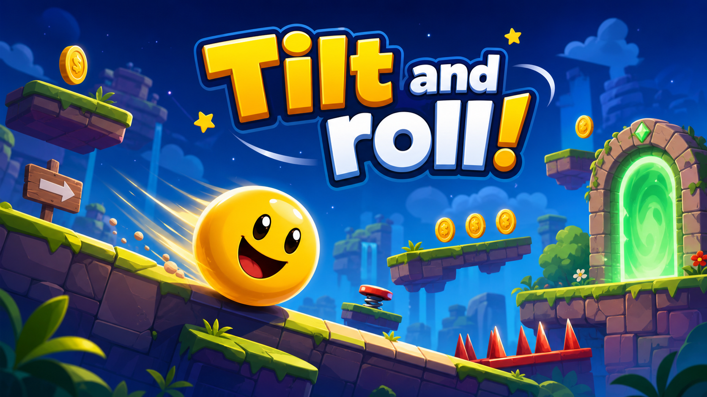

# Tilt and roll!

Небольшой кроссплатформенный прототип игры на LibGDX и Box2D для desktop и Android.



## Идея

Игрок управляет физическим шаром, собирает монеты, избегает красных опасных зон и добирается до зеленого финиша. Box2D отвечает за гравитацию, платформы, столкновения, сенсоры монет, сенсоры опасности, пружины и проверку нахождения на земле.

## Управление

- Desktop: `A/D` или стрелки для движения, `Space` или `Up` для прыжка, `R` для рестарта, `M` или `Esc` для выбора уровня.
- Android: наклон устройства для движения, тап в любом месте для прыжка, встряхивание для рестарта или перехода на следующий уровень после победы.

## Структура

- `core` - общая игровая логика, физика Box2D, отрисовка и ввод.
- `com.codex.gravitytilt` - главный класс `GravityTiltGame`.
- `com.codex.gravitytilt.objects` - иерархия игровых сущностей: `GameObject`, `BoxGameObject`, `CircleGameObject`, `Player`, `Coin`, `Platform`, `Hazard`, `Goal`, `PlayerFoot`.
- `com.codex.gravitytilt.effects` - частицы монет, круги поражения и салют победы.
- `com.codex.gravitytilt.physics` - `BodyFactory` и `GameContactListener`.
- `com.codex.gravitytilt.input` - `GameControls`.
- Игровые сущности хранятся в одном `Array<GameObject>`, а Box2D `Fixture.userData` ссылается на сами объекты.
- `lwjgl3` - desktop launcher.
- `android` - Android launcher и manifest.


Class diagram: [CLASS_DIAGRAM.md](CLASS_DIAGRAM.md)

## APK

[Download Android APK](tilt-and-roll-debug.apk)

## Демо-видео

<video src="TiltAndRoll.mp4" controls width="720"></video>

[Скачать или открыть видео](TiltAndRoll.mp4)

## Запуск

Нужны JDK 17+ и Gradle 8.13+. Если Gradle установлен:

```bash
gradle lwjgl3:run
```

Сборка Android APK:

```bash
gradle android:assembleDebug
```

Если Gradle не установлен, удобнее открыть папку проекта в IntelliJ IDEA или Android Studio: IDE предложит импортировать Gradle-проект и скачать зависимости из `mavenCentral()`/`google()`.

## Зависимости

Проект использует LibGDX `1.14.2`, включая `gdx-box2d` и нативные Box2D-библиотеки для desktop/Android.
